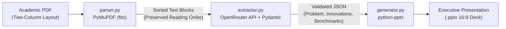

# ParseDeck

> **Automated Technical Research Paper to Executive Presentation Deck Engine**

**ParseDeck** ingests academic database and systems research papers (PDFs), extracts core technical contributions using OpenRouter LLMs with Pydantic structured validation, and compiles them into a PowerPoint presentation (`.pptx`) via `python-pptx`.

---

## Architecture & Pipeline



1. **Multi-Column Ingestion (`parser.py`)**: Uses PyMuPDF (`fitz`) to detect block coordinates (`x0, y0, x1, y1`). Segregates full-width headers/abstracts, sorts left-column blocks vertically by `y0`, and right-column blocks vertically by `y0`, guaranteeing natural reading order across two-column academic layouts (ACM, IEEE, VLDB, SIGMOD, arXiv).
2. **Structured Contribution Extraction (`extractor.py`)**: Leverages OpenRouter API with Pydantic schema validation to extract:
   - Fundamental architectural bottlenecks and problem limitations
   - Primary technical innovation and modular system components
   - End-to-end algorithm overview and execution stages
   - Quantitative empirical benchmark results (workloads, baselines, and speedup factors)
   - Real-world system trade-offs and deployment implications
3. **Deck Automation (`generator.py`)**: Programmatically creates a 6-slide, 16:9 widescreen presentation using custom visual hierarchy, cards, status badges, and typography.
4. **CLI Orchestration (`main.py`)**: Command-line interface with `argparse` tying the stages together with progress logging and JSON export capabilities.

---

## File Structure

```text
ParseDeck/
├── requirements.txt      # Project dependencies (PyMuPDF, requests, pydantic, python-pptx, python-dotenv)
├── parser.py             # Multi-column PDF layout-aware text extraction
├── extractor.py          # OpenRouter API client & Pydantic structured schemas
├── generator.py          # python-pptx presentation deck builder
├── main.py               # CLI entry point orchestrating parser -> extractor -> generator
├── test_pipeline.py      # Automated test suite (PDF layout, Pydantic, PPTX, CLI)
└── README.md             # Documentation and usage guide
```

---

## Installation

### Prerequisites
- Python 3.10 or higher
- An OpenRouter API key ([openrouter.ai](https://openrouter.ai/keys))
- (Recommended) [uv](https://docs.astral.sh/uv/) for high-speed package management

### 1. Clone the repository
```bash
git clone https://github.com/kashish1928/ParseDeck.git
cd ParseDeck
```

### 2. Create Virtual Environment & Install Dependencies

#### Using `uv` (Recommended)
```bash
# Create virtual environment with uv
uv venv

# Activate virtual environment
source .venv/bin/activate

# Install dependencies at lightning speed
uv pip install -r requirements.txt
```

*Tip: You can also execute commands directly with `uv run`, e.g.:*
```bash
uv run python main.py paper.pdf
```

#### Using standard `venv`
```bash
python3 -m venv .venv
source .venv/bin/activate
pip install -r requirements.txt
```

---

## Environment Setup

ParseDeck requires an OpenRouter API key to extract structured contributions.

Create a `.env` file in the project root:

```bash
# .env
OPENROUTER_API_KEY=sk-or-v1-your-openrouter-api-key-here

# Optional: Default model (defaults to google/gemini-2.5-flash)
OPENROUTER_MODEL=google/gemini-2.5-flash
```

Alternatively, export the environment variable in your shell:

```bash
export OPENROUTER_API_KEY="sk-or-v1-your-openrouter-api-key-here"
```

---

## CLI Usage

Run `main.py` directly from the terminal:

```bash
python main.py <path_to_pdf> [options]
```

### Basic Example
```bash
python main.py papers/vldb2024_paper.pdf
```
*Outputs a 16:9 presentation deck: `papers/vldb2024_paper_presentation.pptx`*

### Specify Output Destination
```bash
python main.py papers/sigmod2024.pdf -o decks/sigmod_summary.pptx
```

### Choose an LLM Model
ParseDeck supports any model available on OpenRouter:
```bash
# Use Claude 3.5 Sonnet
python main.py paper.pdf --model anthropic/claude-3.5-sonnet

# Use GPT-4o
python main.py paper.pdf --model openai/gpt-4o

# Use DeepSeek R1 or Gemini
python main.py paper.pdf --model deepseek/deepseek-r1
```

### Limit Number of Pages & Save Structured JSON
For lengthy papers with extensive appendices or bibliographies:
```bash
python main.py paper.pdf \
  --max-pages 12 \
  --save-json metadata.json \
  -o presentation.pptx \
  --verbose
```

### CLI Arguments Reference

| Argument | Flag | Default | Description |
|---|---|---|---|
| `pdf` | Positional | *Required* | Path to the research paper PDF |
| `--output` | `-o` | `<stem>_presentation.pptx` | Output `.pptx` presentation path |
| `--model` | `-m` | `google/gemini-2.5-flash` | OpenRouter model ID |
| `--api-key` | `-k` | `os.getenv("OPENROUTER_API_KEY")` | Override OpenRouter API key |
| `--max-pages` | N/A | `None` (all pages) | Limit number of parsed pages |
| `--save-json` | N/A | `None` | Save extracted Pydantic JSON to disk |
| `--verbose` | `-v` | `False` | Enable debug logging |

---

## Programmatic Python API

You can also use ParseDeck components directly inside your own Python scripts or web applications:

```python
from parser import parse_pdf
from extractor import extract_contributions
from generator import generate_presentation

# 1. Parse two-column PDF text
doc = parse_pdf("path/to/paper.pdf", max_pages=10)
print(f"Extracted {doc.total_pages} pages ({len(doc.full_text)} chars)")

# 2. Extract structured analysis via OpenRouter + Pydantic
analysis = extract_contributions(doc.full_text, model="google/gemini-2.5-flash")
print(f"Paper: {analysis.title}")
print(f"Core Innovation: {analysis.key_innovation}")

# 3. Generate PowerPoint deck
deck_path = generate_presentation(analysis, output_path="output_deck.pptx")
print(f"Deck created at: {deck_path}")
```

---

## Slide Deck Overview

ParseDeck programmatically produces a 6-slide executive deck tailored for database and systems research:

| Slide | Section | Content |
|---|---|---|
| **Slide 1** | **Title & Executive Briefing** | Dark navy executive theme with paper title, authors, venue tag, and executive summary callout. |
| **Slide 2** | **Core Problem & Bottlenecks** | Dual-card layout analyzing the core architectural bottleneck alongside existing system limitations. |
| **Slide 3** | **Key Technical Innovation** | High-contrast hero card for the primary paradigm shift, followed by 3 architectural component breakdowns. |
| **Slide 4** | **Algorithm & Execution Flow** | High-level pipeline overview with sequential phased cards detailing step-by-step mechanics. |
| **Slide 5** | **Empirical Benchmark Results** | Structured metric cards highlighting quantitative speedups, baseline systems, workloads, and takeaways. |
| **Slide 6** | **System Implications & Takeaways** | Hardware trade-offs, memory/compute overheads, and 3 core conclusions for practitioners. |

---

## Running the Automated Test Suite

ParseDeck includes a unit and integration test suite:

```bash
python test_pipeline.py
```

Tests verify:
- Coordinate-based two-column reading order extraction in `parser.py`
- Pydantic schema validation and JSON serialization in `extractor.py`
- Programmatic slide and shape generation in `generator.py`
- CLI argument parsing and help menus in `main.py`

---

## License

This project is licensed under the MIT License - see the [LICENSE](LICENSE) file for details.